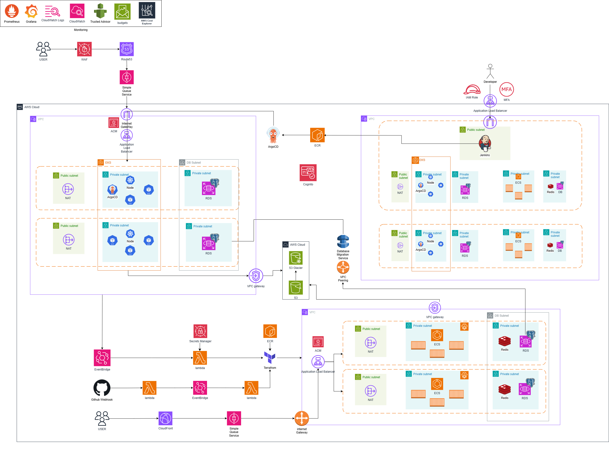

# CLOUD WAVE 5기 : CJ 올리브영 온라인 쇼핑몰 인프라 구축
 

## 📌 TEAM JungleGYM
| 마석재(PM) | 계현준 | 김찬수 | 연제민 | 이경민 | 장현아 |
|:----:|:-----:|:----:|:----:|:-----:|:----:|
|  |  |  |  |  |  |
| <a href="https://github.com/MASEOKJAE">@MASEOKJAE</a> | <a href="https://github.com/kyebalza">@kyebalza</a> | <a href="https://github.com/ckqrhdl">@ckqrhdl</a> | <a href="https://github.com/jemsgusting">@jemsgusting</a> | <a href="https://github.com/rudalsss">@rudalsss</a> | <a href="https://github.com/hyeonahhh">@hyeonahhh</a> |
 

## 📌 전체 아키텍처

 

### 📌 아키텍처 구조
저희 아키텍처는 크게 개발계, 운영계, 이벤트계로 이루어져 있습니다.

 
 

## 🕹 Tech Stack

## 1️⃣ 개발계

<strong> OPEN </strong>

       
 

개발겸 QA를 위한 공간으로 자동화된 CI/CD작업이 이루어지도록 구성하였습니다.
 
### *✅* Jenkins pipeline

Jenkins 파이프라인은 코드 테스트, 보안 검사(Code & Image Scanning), 컨테이너 이미지 배포까지의 프로세스를 자동화하였습니다.

- 동작 과정
    - GitHub WebHook이 Jenkins에 HTTP 요청을 보내 파이프라인 실행을 트리거
    - 코드 테스트 : 소스코드 내에서 JUnit 5 + Mockito (Java) 와 npm (Node.js) 테스트 도구를 사용하여 유닛 테스트를 수행
- 보안 관리
    - 코드 보안 검사 : SonarQube를 통해 코드 품질 분석 및 정적 코드 검사를 수행 & Dependency-Check로 오픈소스 라이브러리에서 보안 취약점을 스캔
    - 이미지 보안 검사 (Image Security Scanning) : Trivy를 통해 빌드된 컨테이너 이미지에서 보안 취약점을 검사
    - 보안 검사를 통과한 이미지를 ECR에 푸시, 이후 EKS와 ECS에서 즉시 배포하여 사용가능

 

## 2️⃣ 운영계

<strong> OPEN </strong>

       
 

개발겸 QA를 위한 공간으로 자동화된 CI/CD작업이 이루어지도록 구성하였습니다.
 
### ✅ ArgoCD

ArgoCD를 이용하여 GitOps방식으로 EKS에서 GitOps방식으로 애플리케이션을 배포하고 관리하도록 하였습니다.

### ✅ EKS

- Multi-AZ(다중 가용 영역)에 배포하여 서비스 가용성이 보장되도록 하였습니다.
- HPA : CPU 사용량을 통해 deployment의 부하를 파악하여 필요한 pod를 늘리도록 하였습니다.
- Karpenter: CPU나 메모리 등의 기준을 통해 node의 부하를 파악하여 필요한 NODE를 늘리도록 하였습니다.

 

## 3️⃣ 이벤트계

<strong> OPEN </strong>

       
 

이벤트 상황에 대비해 부하 분산을 수행하고 비용을 절감할 수 있도록 자동화된 아키텍처로 구성되어 있는 이벤트계를 설계했습니다.
 

### ✅ 이벤트계 구성 효과

- 부하 분산 : 운영계와 독립적인 이벤트계를 구성하며 운영계의 부하 부담을 줄였습니다.
- 비용 절감 : IaC 활용하여 이벤트계 필요시 AWS 리소스를 생성 및 해제하며 비용 부담을 줄였습니다.

### ✅ 이벤트계 전체 아키텍처

- EventBridge가 event 시작, 종료 시간을 트리거
- 트리거를 Lambda가 받아 로직을 수행
- event 종료 이후 이벤트계의 DB 데이터를 운영계 DB로 마이그레이션

### ✅ Lambda 내부 동작 과정

- Event 실행용 Lambda
    - Secrets Manager에서 Pem키를 다운받고 Terraform 실행용 EC2 생성
    - SSH 접속 및 Terraform apply 실행
    - 실패시 Slack 알림
- Event 종료용 Lambda
    - Secrets Manager에서 Pem키 다운받고 EC2에 SSH 접속
    - Terraform destroy 실행 및 EC2 삭제
    - 실패시 Slack 알림

### ✅ DMS

- 동작 과정
    - EventBridge에서 DMS 태스크를 실행하도록 트리거
    - DMS는 source에서 target으로 데이터 마이그레이션 수행
- 특징
    - 이벤트계 저장 시 운영계 DB를 스키마로 분리하여 저장
    - 데이터 정합성을 최대한 확보하기 위해 1시간에 한번씩 데이터 마이그레이션 수행

### ✅ ECS

- 비용 효율적이며 관리 부담이 적고 빠르게 배포될 수 있는 ECS를 선택
- Fargate를 선택해 서버리스 환경을 구성했고, 부하 정도에 따라 컨테이너가 자동 확장

 

## 4️⃣ 모니터링 및 추후관리

<strong> OPEN </strong>

       
 
  

- Prometheus + Grafana : 운영계의 서비스를 담당하는 EKS의 metric data를 수집하고 시각화
- Alertmanager를 통해 Grafana Alert Rule에 따라 에러 및 경고 메시지를 Slack에 실시간으로 알람전송
- CloudWatch + Grafana : 이벤트계 서비스를 담당하는 ECS, Lambda 와 RDS의 metric data를 수집하고 시각화
- Firehose : RDS, 람다, EKS, ECS 등의 이벤트 로그를 S3에 저장 → 추후 Athena를 이용하여 서비스 개선에 도움이 되는 데이터분석을 실행할 예정

 
